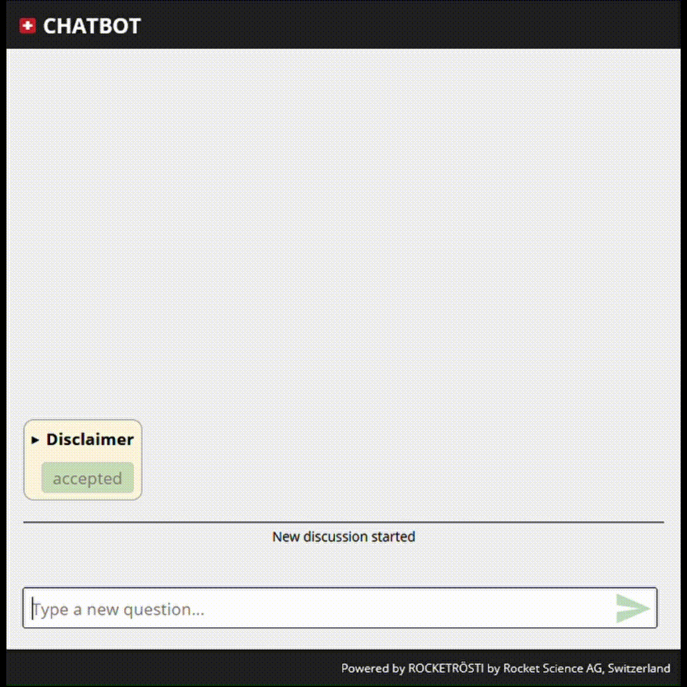

# ROCKETRÖSTI
Create a conversational agent (think chatbot) to answer questions about textual documents using an LLM such as GPT-4. You can import your documents (in *.txt* format) into it. The framework is generic enough that information extraction from textual documents is only an example of what it can do.

You can run a demo after the initial installation. It contains a chatbot with knowledge about Switzerland:



Note that you need an OpenAI API Key to make the demo work.

## Overview

ROCKETRÖSTI provides a set of tools tailored for interacting with Large Language Models (LLMs). It's primary strength is in data analysis and text-based information retrieval, demonstrated through its default "rtfm" tool. While the system has been designed with extensibility in mind, its adaptability is best realized through hands-on tinkering and understanding its cleanly-written, mypy-typed codebase. Users looking to harness LLMs for specialized applications will find a solid starting point here, alongside comprehensive docstrings and guidance.

The chatbot's functionality is defined in a [YAML document](assets/prompt.yaml) with all the prompts and parameters.

## Getting started

To get started, you need to have an OpenAI account. Then you need to install Poetry, which installs the dependencies for you. See below for the individual steps.

Using the default GPT-4, queries generally cost a few cents each. You can also change it to use GPT-3.5 which costs only 1/20th of the price of GPT-4, but it is harder to get it to give good answers (i.e. you will need to invest more time in tuning the instructions). You could also play with the 16k GPT-3.5 model, which will allow you to give much more instructions and examples of the kinds of answers you want, at 1/10th of the cost of GPT-4.

### Installing dependencies

We use the Poetry package manager. Install it from https://python-poetry.org/ and then run `poetry install --no-root` from the root directory of the repository to install the dependencies. This will not modify your system Python installation.

The project is tested to work with Python 3.10. Everything else poetry should be able to install for you. If you have no Python 3.10 installation, you can try to relax the dependencies in [`pyproject.toml`](./pyproject.toml) and rerun `poetry install --no-root`.

### OpenAI API key

Next you need to set up your OpenAI API access. You can use either the [OpenAI API](https://openai.com/product) or Azure's OpenAI API for GPT.

If you don't have an OpenAI API key, you need to generate one in your OpenAI account. [By default](config.defaults.yaml), the system will try to find your API key in the following places and in the following order ([defined in the configuration file](#modify-the-configuration-if-needed))):

| Step | When using OpenAI | When using Azure |
| ---- | ----------------- | ---------------- |
| 1.   | The environment variable `OPENAI_API_KEY_OPENAI` | The environment variable `OPENAI_API_KEY_AZURE` |
| 2.   | The environment variable `OPENAI_API_KEY` | The file `.openai.apikey.azure` in your home directory |
| 3.   | The file `.openai.apikey` in your home directory | The environment variable `OPENAI_API_KEY` |

The configuration is set to use the OpenAI API by default. If you want to use Azure instead, you need to modify the configuration file (see [below](#modify-the-configuration-if-needed)).

### Importing documents (optional)

We have provided some example documents—a few Wikipedia articles—in the [`data/source_documents`](data/source_documents) directory. You can use these to try out the system.

Alternatively, you can replace (or augment) those documents with your own ones. To do this, drop your text files into the [`data/source_documents`] directory with a filename ending in ".txt". The files in this directory will be processed when you start the backend. This also means that after modifications to the directory, the backend may take a while to start up. (You can follow the progress on the console.)

### Run the backend

To run the backend, run `./run_backend.sh` in the repository root. This just executes `poetry run -- python -m rrosti.servers.serve_data_retrieval_ws --debug-send-intermediates`; you might want to run that command with `--help` to see other command line options. This will start a websocket server, by default, on port 8765, listening for local connections only. The `--debug-send-intermediates` flag will cause the server to send intermediate messsages (e.g. between the agents, or results from a tool) to the frontend, which is useful for understanding what is going on. You can run `poetry run -- python -m rrosti.servers.serve_data_retrieval_ws --help` to see the available options.

### Run the frontend

You can run the frontend on the same computer by running `./run_frontend.sh`, which executes `poetry run -- python -m flask --app rrosti.frontend.client run`. This will start a web server on port 5000, listening for local connections only. Then you can open http://localhost:5000/ in your browser to access the frontend.


### Modify the configuration (if needed)


The default configuration is defined in [`assets/config.defaults.yaml`](assets/config.defaults.yaml). You can override parts of it by creating a file called `config.yaml` in the repository root. For example, assume you want to change the page title of the frontend page and the port that the backend listens on. You would create a file called `config.yaml` with the following contents:

```yaml
frontend:
    title: "My totally awesome chatbot"

backend:
    listen_port: 1234
```

### What next?

The default prompt demonstrates using the `rtfm` tool for information retrieval from the documents. If you want to explore making your own tools, you should look at the implementation of the rtfm tool in [`rrosti/chat/state_machine/execution.py`](rrosti/chat/state_machine/execution.py#:~:text=class%20_Rtfm) and the implementation of a `python` tool that you can configure to execute Python code produced by the LLM in [the same file](rrosti/chat/state_machine/execution.py#:~:text=class%20_Python) (yet be aware that executing code received from the network "may" be a security risk).

## Brief description of the functionality

### Document database

When documents are imported into the system, they are cut into overlapping extracts of text, called snippets. At this time, embeddings are calculated for those snippets.

### Agents and tools

In the [prompt definition file](assets/prompt.yaml), you define one or more agents. Typically, one agent would communicate with the user. The agents can communicate with each other by sending messages to each other. This allows you to enforce a division of responsibilities between different parts of the system, which may help the LLM you use.

Agents are actors that receive messages and produce responses, always invoking an LLM to do so. They may additionally invoke tools to produce information that they need to produce the response. An example of a tool is the "rtfm" tool, which is used to find the most relevant snippets in the document database for a given question.

Agents only execute when they receive a message, and only until they pass the conversation to another agent. This allows you to define a conversation flow in which different agents are responsible for different parts of the conversation.

A simple system would typically only have one agent, which would be responsible for the entire conversation. In this case, that agent will be in control of asking the user for input and sending responses to the user. In a more complex system, typically you would still have one agent in this role, but it would use other agents to help it with the conversation.

Each agent has its own message history, which is a list of messages that it has received and sent. When an agent executes, it always sees its own history (and only that).

### Agents, tools, and states

In the [prompt definition file](assets/prompt.yaml), you define one or more agents. The agents can communicate by sending messages to each other or to the user. Agents are actors that receive messages and produce responses, always invoking an LLM to do so. Additionally, they might invoke tools to gather relevant information for the response. An example of such a tool is the "rtfm" tool, which finds the most pertinent snippets from the document database for a given question.

Agents become active when they receive a message and remain so until they hand over the conversation to another agent. Each agent maintains its own message history, a record of received and sent messages. When an agent is in operation, it exclusively views its history. This facilitates a clear division of responsibilities between system components, potentially aiding the LLM.

Rocketrösti's foundation is a state machine, and agents can exist in different states. Crucially, the LLM is invoked only during a state transition. Both state changes within the same agent and sending a message to another agent count as state transitions, automatically prompting the LLM. The response generated by the LLM is then passed to the next agent or state. Note that in Rocketrösti, LLM invocation is implicit; it's not explicitly mentioned in the prompt definition file.

Each state has a name, can execute actions, and is able to probe the LLM responses for conditions.

- **Naming:** Every agent requires an `initial` state and can have any other name for subsequent states.
- **Actions:** Built-in actions include `message`, `goto`, and `send`.
  - `message`: Adds a message to the agent's history as the latest message. The message execution can invoke tools by using syntax like `{rtfm()})` or it can be simply static text. Remember, the LLM is invoked only during state changes, not after every `message` action. This allows you to add multiple messages to the agent's history before invoking the LLM.
  - `goto`: Changes the state of the agent to the specified state. In the absence of a `goto`, there will be a state transition (and thus an LLM invocation) _to the current state_.
  - `send`: Adds a message to the history of the specified agent, and transfers control to that agent. When this agent regains control, it will transition to the state specified in the `next_state` field. Here's its syntax:

  ```
  action:
  -   send:
          to: agent_2
          next_state: main
  ```

- **Conditions:** To guide the state machine based on LLM responses, each state can include conditions. Rocketrösti offers a basic "if contains [example string] then action" condition and a mandatory `default` condition that will be executed if none of the other conditions match.

#### Description of the example YAML file

- **config:** In this section, you can choose the desired LLM. Rocketrösti was developed using gpt-4, but in theory, any LLM can be integrated. However, when working with weaker LLMs, adjustments to the example prompt might be necessary to ensure smooth state machine operation.
- **variables:** Here, you can define the prompt which, in turn, dictates the behavior of the state machine. For clarity, prompts can be divided into segments, as illustrated with `instructions_system_top`, `instructions_general_rules`, and so forth. Additionally, it's possible to reference previously defined variables in new definitions, as showcased with the `use_case` variable within `instructions_system_top`.
- **agents:** This section is for defining agents. For the provided simple document retrieval demonstration, a single agent (`agent_1`) manages both user interactions and queries. After processing its initial messages containing general instructions, the agent awaits user input using the `{user_input()}` message. This puts the frontend in an idle state, waiting for user input. Once the query is received, `agent_1` gets its final instructions on database querying and then transitions to the `execute_query` state.

This state transition invokes the LLM, which then responds based on the provided instructions. The `execute_query` state has multiple conditions:

- If the produced response contains `$$$rtfm`, it indicates that `agent_1` intends to start the information retrieval process. The `{rtfm()}` message activates the rtfm tool, which searches for snippets and replaces the `{rtfm()}` text with them, adding the resulting message to the agent's history. This message, along with LLM instructions, is processed during the next state transition.
- A conversation that ends with `kthxbye` leaves the state machine waiting for the next user input while retaining the chat history in the agent's context. The context can be reset only by clicking the + button in the frontend (next to the input field).
- According to `instructions_general_rules`, the LLM flags any non-compliant user queries with the `$$$error$$$` string. This error is also the default for empty LLM responses, such as those encountered on platforms like Microsoft Azure. We suggest not altering this error string.
- A default condition is in place to handle any other scenarios.

Finally, in the `answer` state, the aggregated snippets and instructions lead to the generation of a final response. Here, the default condition is set to expect another user query, provides instructions on how to address further queries, and then reroutes the state machine back to `execute_query`, initiating the cycle again.

### Snippet retrieval

In the [prompt definition YAML file](assets/prompt.yaml), an agent can execute snippet retrieval queries. To do this, it is instructed to produce a text similar or related to the information it wants to find. Then the embedding of this text is generated and a vector database is used to find the closest matching snippets from the snippet database. The snippets are added as a response message to the agent's message history, and the agent can be instructed to answer the question based on the them.
